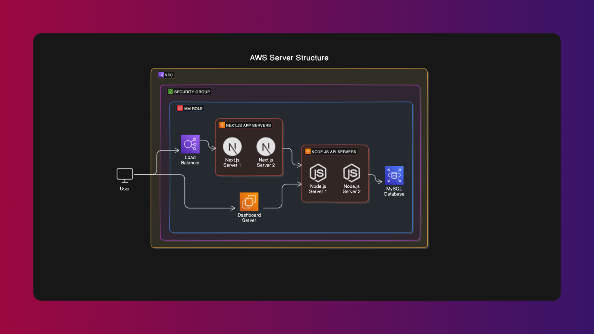

# Brandberry Showcase

[Brandberry](https://brandberry-frontend.vercel.app/) ist ein fiktives Startup, welches Unternehmen maßgeschneiderte Webdesign-Lösungen bietet.
Clienten werden ab der ersten Idee bis zur fertigen Website begleitet. Der Workflow beinhaltet einen agilen Ansatz und einen transparenten Projektverlauf, welcher eine effiziente Zusammenarbeit garantiert.
Darüber hinaus ist der Workflow so konzipiert, dass das erste Ergebnis - abhängig vom Umfang der Anfrage - nach 48 Stunden ausgeliefert wird.

Diese Website und künftige Anfragen werden unter Verwendung folgender Technologien erstellt:

Frontend:

- React(Next.js+TypeScript)
- Styled Components
- Lenis

Backend:

- Node.js(Express, mysql2)
- MySQL

## Projekt-Erläuterung

Die Website ist ein Multipager, dessen Design und Planung in Figma und Miro erfolgt ist. Auf Code-Ebene haben wir uns im Frontend für Next.js mit TypeScript und Styled Components entschieden, im Backend für Node.js und MySQL.

Das Design ist weiterhin ein fließender Prozess und spielt bei der Gestaltung des Produktes - der Dienstleistung - eine tragende Rolle. Bei dem Design achten wir darauf, dass wir uns so gut es geht an die 60-30-10-Verteilung halten, um eine angenehme Wahrnehmung zu gewährleisten.

Grundsätzlich ist das Styling über CSS und/oder Tailwind möglich, wir wollen aber dem Ansatz des "Atomic Design" und des "Clean Code" folgen, was natürlich React-Komponenten entgegenkommt.

Aus diesem Grund definieren wir lediglich Variablen über eine globals.css und erstellen den Rest des Stylings in der Komponente selbst.

Im Backend verfolgen wir einen ähnlichen Ansatz. Next.js macht es grundsätzlich möglich, dass API-Calls über die Anwendung selber gemacht werden können, was aber die Skalierbarkeit erschwert.

Darum setzen wir hier auf die Modularisierung, trennen das Frontend vom Backend, wodurch die REST-API über eine Node.js Instanz stattfindet und Anfragen von der Next.js App an die MySQL-Datenbank weiterleitet und verarbeitet.

## Ordnerstruktur

Hierbei handelt es sich um eine vorläufige Ordnerstruktur.

```
Brandberry
+---.next
\---node_modules
|
+---public
\---src
|    \---app
|        |   favicon.ico
|        |   globals.css     /* Hier werden alle Variablen definiert, die später in den Komponenten verwendet werden */
|        |   layout.tsx     /* Die layout.tsx und die page.tsx dienen lediglich einem redirect, um das Hauptverzeichnis sauber zu halten */
|        |   page.tsx
|        |
|        +---about
|        |   |   layout.tsx     /* Jede standard Route beinhaltet eine layout.tsx, um die parallelen Routen einzureihen*/
|        |   |
|        |   +---@hero
|        |   |       page.tsx     /* Jede parallele Route beinhaltet eine page.tsx */
|        |   |
|        |   |
|        |   +---@skills
|        |   |
|        |   +---@statement
|        |   |
|        |   \---@team
|        |
|        +---home
|        |
|        +---services
|        |
|        +---_components     /* Hier werden alle Komponenten definiert */
|        |
|        \---_lib     /* Dieser Ordner beinhaltet Skripte, um z.B. styled-components nutzbar zu machen */
|
|   .eslintrc.json
|   .gitignore
|   next-env.d.ts
|   next.config.mjs
|   package-lock.json
|   package.json
|   README.md
|   tsconfig.json
```

## Potenzielle Server-Struktur auf AWS


